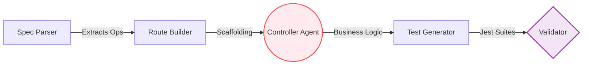
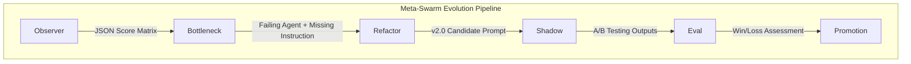

# MetaSwarm 🐝

> **Not just agents working together — agents improving each other.**

MetaSwarm is a state-of-the-art, autonomous, self-evolving multi-agent system built on top of `autogen-agentchat` (v0.7). It demonstrates a complete failure-diagnosis-improvement pipeline where a team of AI worker agents attempts a complex coding task, inevitably fails, and then a secondary "meta-swarm" analyzes the failure, isolates the root cause, surgically refactors the failing agent's system prompt, and promotes a new, improved version into production.

---

## 🎯 The Problem MetaSwarm Solves

Current multi-agent systems are brittle. When you chain multiple LLMs together, a hallucination or logic gap early in the pipeline compounds into a total system failure. 

Traditionally, solving this requires **manual prompt engineering**:
1. A developer sifts through megabytes of execution traces.
2. They identify which agent dropped the ball.
3. They manually rewrite that agent's system prompt to handle the edge case.
4. They hope the new prompt doesn't break something else that was already working.

**MetaSwarm solves this by fully automating the prompt engineering loop.** It treats system prompts not as static configuration, but as mutable code that the system itself can profile, debug, and rewrite at runtime.

---

## ⚙️ How It Solves It: The Dual-Swarm Architecture

MetaSwarm decouples the system into two distinct networks: the **Worker Swarm** that does the actual software engineering, and the **Meta-Swarm** that manages the worker swarm's capability.

### 1. The Worker Swarm (Linear Assembly Line)
Instead of chaotic conversational free-for-alls (like `GroupChat`), the worker swarm uses a strictly deterministic, linear pipeline to build an Express.js API from an OpenAPI specification. 



*In the live demo, the **Controller Agent** is deliberately seeded at `v1.0` with a naive prompt that lacks the instruction to read the business logic out of the spec. This guarantees a deterministic failure at the Validator step.*

### 2. The Meta-Swarm (Evolution Loop)
When the worker pipeline fails (Validator score < 70), the Meta-Swarm kicks in. It operates entirely on the execution traces generated by the worker swarm.



#### The Meta-Agents:
- **👁️ Observer:** Reads every execution trace from the failed run. Scores all 5 worker agents (0-100) using a strict JSON rubric. (Temperature 0)
- **🔍 Bottleneck:** Analyzes the Observer's scores to pinpoint the single agent responsible for the pipeline failure. Generates a precise `missing_instruction` string. (Temperature 0)
- **✍️ Refactor:** Takes the failing agent's `v1.0` prompt and the `missing_instruction`. Surgically rewrites the prompt to address the root cause while strictly preserving existing capabilities. (Temperature 0.3)
- **👥 Shadow:** An A/B testing sandbox. It instantiates the failing agent with the `v2.0` candidate prompt and replays the exact same inputs from the failed run, without affecting the live pipeline.
- **⚖️ Eval:** A deterministic quality gate. It compares the `v1.0` output against the `v2.0` shadow output using a strict 4-dimensional rubric. (Temperature 0)
- **🚀 Promotion:** If `v2.0` outscores `v1.0` and crosses the required threshold (70/100), the new prompt is permanently written to the registry and dynamically loaded into the live pipeline.

---

## 🌊 What Gets Affected (The Impact)

When MetaSwarm successfully completes an evolution cycle, the following systemic shifts occur:

1. **System Prompts are Hot-Swapped:** The registry updates the failing agent (e.g., the Controller Agent) from `v1.0` to `v2.0`. The next time the worker pipeline runs, it dynamically fetches the new, highly-optimized prompt.
2. **Auto-Healing Pipelines:** Workflows that were entirely broken by unhandled edge cases are fixed dynamically. The system learns how to perform its tasks better over time without human intervention.
3. **Safe Deployments:** Because of the **Shadow** and **Eval** agents, a hallucinated or degrading prompt from the Refactor agent will never be promoted to the live pipeline. It must mathematically prove it is better than `v1.0` before promotion.
4. **Decoupled Observability:** MetaSwarm writes all I/O traces directly to its own Cosmos DB / JSON registry. This creates an independent, queryable source of truth for the Observer agent without vendor lock-in to third-party tracing platforms.

---

## 🚀 Getting Started

### Prerequisites
- Python 3.10+
- Node.js & npm (for the React dashboard)
- `uv` (recommended for Python package management)
- API Keys for OpenAI or Azure OpenAI

### Backend Setup

1. **Initialize the virtual environment:**
   ```bash
   uv venv
   source .venv/bin/activate
   ```

2. **Install dependencies:**
   ```bash
   uv pip install autogen-agentchat autogen-ext[openai] azure-cosmos python-dotenv fastapi uvicorn
   ```

3. **Configure Environment:**
   Create a `.env` file in the root directory. You can use standard OpenAI or Azure OpenAI:
   ```env
   # Standard OpenAI
   OPENAI_API_KEY=your_key_here
   OPENAI_MODEL=gpt-4o

   # Azure OpenAI (Preferred for deterministic demos)
   AZURE_OPENAI_KEY=your_azure_key
   AZURE_OPENAI_ENDPOINT=https://your-resource.openai.azure.com/
   AZURE_OPENAI_DEPLOYMENT=gpt-4o
   AZURE_OPENAI_API_VERSION=2024-08-01-preview

   # Registry Backend (local or cosmos)
   REGISTRY_BACKEND=local
   ```

### Dashboard Setup

The React dashboard visualizes the evolution process in real-time via Server-Sent Events (SSE).

1. **Install frontend dependencies:**
   ```bash
   cd dashboard
   npm install
   ```

2. **Run the Vite dev server:**
   ```bash
   npm run dev
   ```
   Open your browser to `http://localhost:5173`.

---

## 🎬 Running the Live Demo

The system is configured to run a highly deterministic 10-15 minute presentation loop. 

### 1. Start the Orchestrator API
In a new terminal, start the FastAPI backend that streams events to the dashboard:
```bash
uvicorn api.server:app --reload --port 8000
```

### 2. Prepare the Initial State (The Ritual)
Before running the demo, seed the registry and reset the Controller Agent to its deliberately failing `v1.0` state:
```bash
python -m demo.seed_registry
python -m demo.reset
```

### 3. Run the MetaSwarm Evolution
Execute the full orchestrator pipeline:
```bash
python -m core.orchestrator --full
```

**Watch the Dashboard:**
1. **Phase 1:** The Worker Swarm attempts to build the API. The Validator rejects the code (usually 0/17 tests passing).
2. **Phase 2:** The Meta-Swarm activates. You will see real-time updates as the Observer scores the failure, Bottleneck diagnoses it, and Refactor rewrites the code.
3. **The Reveal:** The `ScoreBar` component animates a side-by-side comparison of `v1.0` vs `v2.0`. 
4. **Promotion:** The Agent Card dynamically updates to `v2.0`.
5. **Phase 3:** The pipeline runs again automatically, this time succeeding with the newly evolved agent.

---

## 📂 Project Structure

```text
metaswarm/
├── core/                  # Core infrastructure
│   ├── orchestrator.py    # Main pipeline runner (linear + meta loops)
│   ├── registry.py        # Central data layer (Local JSON / Cosmos DB)
│   ├── tracer.py          # AutoGen v0.7 I/O tracing wrappers
│   ├── config.py          # Strict LLM client factories (temp 0 vs 0.7)
│   └── rubric.py          # JSON Eval scoring schemas
├── agents/                
│   ├── workers/           # Pipeline builders (Spec -> Route -> Controller -> Test -> Validator)
│   └── meta/              # Evolution loop agents (Observer -> Bottleneck -> Refactor -> Shadow -> Eval -> Promote)
├── demo/                  
│   ├── spec.json          # The deliberately complex challenge task
│   ├── reset.py           # Pre-demo cleanup
│   └── seed_registry.py   # v1.0 naive prompt generation
├── api/                   
│   └── server.py          # FastAPI SSE streaming with load-balancer heartbeats
└── dashboard/             # React Frontend (Vite)
    └── src/components/    # Real-time UI widgets (AgentCard, LiveLog, ScoreBar)
```

---

## 🧠 Design Deep-Dives

**Why not GroupChat?**  
`GroupChat` introduces non-determinism (the manager decides who speaks next). For reproducible worker pipelines (like processing an API spec), a strict linear sequential chain guarantees that the Output of Agent A is exactly the Input of Agent B. Save dynamic routing for situations that actually require it.

**The Cache Seed Trap**  
AutoGen caches LLM responses by default. In an evolving system, this is catastrophic—if an agent fails, and is then promoted to `v2.0`, a cached response will instantly fail it again using stale `v1.0` outputs. MetaSwarm specifically disables caching for all agents involved in the evolution loop to guarantee fresh, dynamic generation.

**Constraining the Refactor Agent**  
The most dangerous agent is the Refactor agent—it can easily over-correct and rewrite an entire system prompt, losing context. We constrain it with specific rules: *"Preserve the structure and tone of the original prompt. Do not remove any existing instruction. Only add the identified missing capability."* This ensures surgical, localized prompt evolution.
